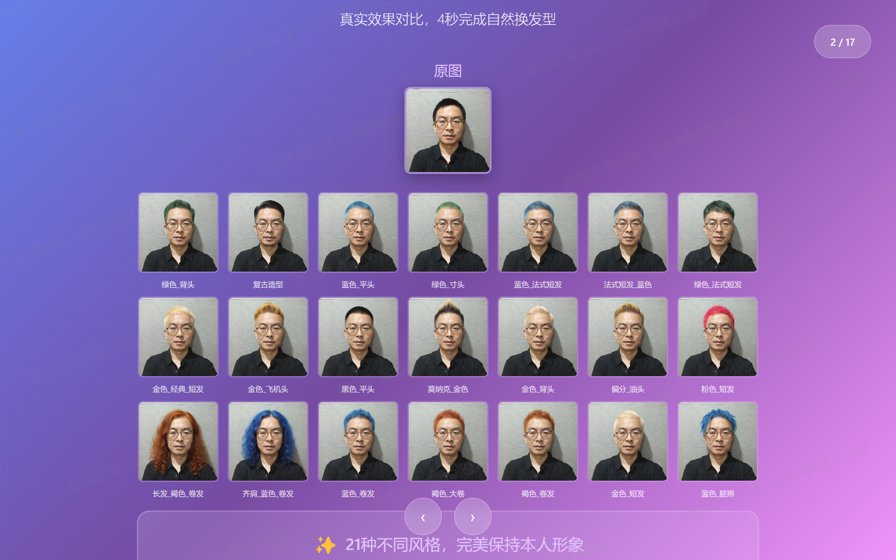

# 🎨 Purple Stylist Prompts

AI造型师提示词库 - 为AI图像生成提供专业的发型设计配置和提示词系统

## 📱 快速体验

<div align="center">

<table>
<tr>
<td align="center" width="50%">

### 🎨 微信小程序体验

扫描小程序码，立即体验 AI 发型设计


**扫码体验「紫色AI造型师」**

4秒完成换发型 · 21种风格 · 保持本人形象

</td>
<td align="center" width="50%">

### 💬 加入微信交流群

扫码加微信，备注「AI发型设计」拉你入群


**一起交流分享**

💡 设计经验 · 🎨 提示词技巧 · 🤖 模型使用

</td>
</tr>
</table>

---

### 📸 效果演示



*真实效果对比 - 4秒完成自然换发型，21种不同风格，完美保持本人形象*

</div>

---

## 📌 项目简介

本项目为基于 AI 的发型设计应用提供全面的配置文件和提示词库。主要特点：

- 🎯 **核心配置文件**: `hairstyles.js` - 包含完整的 API 配置、发型库和提示词模板
- 👥 **全面覆盖**: 支持男士、女士和宝宝发型，涵盖各种流行风格
- 🚀 **多模型支持**: 
  - ✅ 当前主力：**Flux Kontext Pro** - 专业的图像编辑模型
  - 🔄 开发中：逐步增加 **Nano Banana**、**SeedEdit** 等其他先进模型
- 💡 **智能设计**: 集成 AI 造型师系统，提供专业的发型分析和推荐
- 🎨 **丰富选项**: 包含 60+ 发色、24+ 染发技术、多种发型长度和样式

> ⚠️ **项目状态**: 持续开发优化中，部分功能和模型支持正在完善

## 📁 项目结构

```
purple_stylist_prompts/
├── prompts/                         # 提示词和配置库
│   ├── hairstyles.js               # 🌟 主配置文件（核心）
│   ├── ai-stylist-prompt.js        # AI造型师提示词
│   ├── categories.yaml             # 分类定义
│   └── tags.yaml                   # 标签系统
├── images/                         # 效果预览图
├── scripts/                        # 辅助脚本
│   ├── search.py                   # 搜索工具
│   ├── validate.py                 # 验证工具
│   └── export.py                   # 导出工具
├── docs/                          # 文档
│   ├── usage.md                    # 使用指南
│   └── contribution.md             # 贡献指南
└── README.md                       # 本文件
```

## ✨ 核心文件说明

### `prompts/hairstyles.js`

这是项目的**核心配置文件**，包含：

1. **API 配置**
   - Flux Kontext Pro API 配置
   - LORA 模型配置
   - LLM API 配置（用于智能分析）

2. **发型库**
   - 男性发型：24+ 种（包含潮流时尚、宝宝发型）
   - 女性发型：25+ 种（包含经典造型、宝宝发型、特殊编发）
   - 每种发型都有详细的英文描述和提示词模板

3. **发型属性配置**
   - 60+ 种发色（金色系、棕色系、灰色系、黑色系、红色系等）
   - 24+ 种染发技术（挑染、渐变、特殊效果等）
   - 5 种发型长度选项
   - 6 种刘海类型
   - 多种发型样式（直发、卷发、层次发等）

4. **智能功能**
   - 动态提示词生成
   - 多种 AI 设计师提示词支持
   - 脸型分析和发型匹配系统

## 🚀 快速开始

### 查看配置文件

```javascript
// 导入配置
const API_CONFIG = require('./prompts/hairstyles.js')

// 获取男性发型列表
const maleHairstyles = API_CONFIG.MALE_HAIR_STYLES

// 获取女性发型列表  
const femaleHairstyles = API_CONFIG.FEMALE_HAIR_STYLES

// 根据性别获取发型
const hairstyles = API_CONFIG.getHairStylesByGender('female')
```

### 生成发型提示词

```javascript
// 生成带颜色的发型提示词
const hairStyle = API_CONFIG.MALE_HAIR_STYLES[0]  // 平头发型
const hairColor = API_CONFIG.HAIR_COLORS[0]       // 脏金色
const prompt = API_CONFIG.generatePrompt(hairStyle, hairColor)

// 输出: "keep character consistent; only change the haircut: dirty blonde, military cut, clean fade;"
```

### 使用搜索工具（可选）

```bash
# 搜索发型（需要配置 YAML 文件）
py scripts/search.py --list-all

# 导出配置
py scripts/export.py --format json --output output.json
```

## 📚 发型库内容

### 👨 男性发型（24种）

#### 潮流时尚系列（12种）
- **经典系列**: 平头、寸头、渐变寸头、美式寸头
- **时尚造型**: 飞机头、蓬巴杜、偏分、背头
- **个性风格**: 莫霍克、脏辫、锯齿分发、法式短发

#### 宝宝发型系列（12种）
- **校园风格**: 中分纹理、中分碎发、锅盖头
- **清爽帅气**: 美式前刺、短发前刺、齐发碎盖
- **时尚潮流**: 三七侧背、微分碎盖、韩式纹理

### 👩 女性发型（25种）

#### 潮流时尚系列（8种）
- **经典造型**: 波波头、精灵短发、马尾辫
- **时尚染发**: 挑染红发、马卡龙色
- **个性设计**: 玉米辫、双马尾
- **优雅波浪**: 中长发波浪

#### 宝宝发型系列（14种）
- **可爱短发**: 蘑菇头、波波卷、蓬松短卷发
- **清新中长**: 中长自然卷发、直发中长发、挂耳短发
- **优雅长发**: 长直发、长卷发、自然卷发
- **时尚扎发**: 双马尾、高马尾、半扎发
- **气质造型**: 公主锁骨发、空气锁骨发

#### 特殊编发系列（2种）
- 瀑布编发、脏辫发型

### 🎨 发色选项（62种）

- **金色系（8种）**: 脏金色、蜂蜜金、白金色、香槟金等
- **棕色系（8种）**: 巧克力色、摩卡色、焦糖色、咖啡色等  
- **灰色系（6种）**: 银灰色、烟灰色、珍珠灰、钢铁灰等
- **黑色系（4种）**: 乌黑色、蓝黑色、棕黑色、自然黑
- **红色系（6种）**: 樱桃红、酒红色、火焰红、玫瑰红等
- **粉色系（5种）**: 玫瑰金、樱花粉、裸粉色、珊瑚粉等
- **紫色系（5种）**: 薰衣草色、葡萄紫、丁香紫、梅子色等
- **蓝色系（5种）**: 海军蓝、钢铁蓝、冰蓝色、天空蓝等
- **绿色系（5种）**: 薄荷绿、森林绿、翡翠绿、霓虹绿等
- **特殊效果（6种）**: 彩虹色、独角兽色、美人鱼色、极光色等

## 🎯 配置文件结构

### 发型对象格式

每个发型包含以下属性：

```javascript
{
  id: 1,                           // 唯一标识符
  name: '平头发型',                // 中文名称
  description: 'Crew Cut - 经典简洁的平头造型',  // 描述
  promptTemplate: 'keep character consistent; only change the haircut: {COLOR}, military cut, clean fade;',
  image: 'cloud://xxx/images/male/crew_cut_hairstyle.jpg',  // 预览图
  
  // 可选：LORA 模型配置（特殊发型）
  useLora: true,                   // 是否使用 LORA 模型
  specialModel: 'flux-kontext-lora',
  loraConfig: {
    modelName: 'hairstyle-lora',
    version: '1.0',
    scale: 1.0,
    files: { /* LORA 文件配置 */ }
  }
}
```

### 发色对象格式

```javascript
{
  id: 1,
  name: '脏金色',                    // 中文名称
  englishName: 'Dirty Blonde',      // 英文名称
  promptValue: 'dirty blonde',      // 提示词值
  colorCode: '#c9a876',             // 颜色代码
  category: 'blonde',               // 颜色分类
  description: '低调奢华的脏金色'   // 描述
}
```

## 🔍 使用场景

### 1. AI 图像生成
直接使用生成的提示词进行图像处理：

```javascript
const prompt = API_CONFIG.generatePrompt(hairStyle, hairColor)
// 输出: "keep character consistent; only change the haircut: honey blonde, modern pompadour, high fade sides..."

// 调用 Flux Kontext Pro API
const result = await generateImage(imageUrl, prompt)
```

### 2. 智能发型推荐系统
集成 AI 造型师进行个性化推荐：

```javascript
// 使用 LLM 分析人脸并推荐发型
const analysis = await API_CONFIG.callLLMForHairstyleAnalysis(imageBase64)

// 根据分析结果筛选合适的发型
const suitableHairstyles = filterHairstyles(analysis, API_CONFIG.MALE_HAIR_STYLES)
```

### 3. 多模型支持
轻松切换不同的 AI 模型：

```javascript
// 获取发型对应的 API 配置
const apiConfig = API_CONFIG.getHairStyleAPIConfig(hairStyle)

if (apiConfig.useLora) {
  // 使用 LORA 模型
  const request = API_CONFIG.generateHairStyleRequest(image, prompt, hairStyle)
}
```

### 4. 自定义发型设计
组合不同属性创建个性化发型：

```javascript
// 生成自定义提示词（不依赖具体发型模板）
const customPrompt = API_CONFIG.generateCustomPrompt(
  hairColor,      // 发色
  hairLength,     // 长度
  bangsType,      // 刘海
  styleType,      // 样式
  dyeingType      // 染发技术
)
```

## 🛠️ 配置与工具

### 核心配置方法

```javascript
// 验证 API 配置
const validation = API_CONFIG.validateConfig()
if (!validation.valid) {
  console.log('配置问题:', validation.issues)
}

// 切换提示词类型
API_CONFIG.setPromptType('trendy')  // 或 'classic'

// 获取当前提示词信息
const promptInfo = API_CONFIG.getCurrentPromptInfo()
console.log('当前使用:', promptInfo.name)

// 调试模式控制
API_CONFIG.DEBUG_MODE = true   // 开启调试日志
API_CONFIG.DEBUG_MODE = false  // 关闭调试日志（生产环境）
```

### 辅助工具脚本（可选）

```bash
# 搜索工具（需要配置 YAML 数据）
py scripts/search.py --help

# 验证工具
py scripts/validate.py

# 导出工具
py scripts/export.py --format json
```

## 🎨 AI 模型支持

### 当前支持

✅ **Flux Kontext Pro** （主力模型）
- 专为图像编辑设计，理解图像上下文
- 支持文本和参考图像作为输入
- 能够进行局部编辑和复杂的场景变换
- API 端点: `https://fal.run/fal-ai/flux-pro/kontext`

✅ **Flux Kontext + LORA**
- 针对特定发型的微调模型
- 提供更精准的发型生成效果
- 支持自定义 LORA 权重配置
- 示例：栗子头专用 LORA 模型

### 规划中

🔄 **即将支持的模型**
- **Nano Banana**: 轻量级快速生成模型
- **SeedEdit**: 基于种子的精确编辑模型
- 更多先进模型持续接入中...

### 模型选择策略

```javascript
// 根据发型自动选择合适的模型
const apiConfig = API_CONFIG.getHairStyleAPIConfig(hairStyle)

if (apiConfig.useLora) {
  console.log('使用 LORA 模型:', apiConfig.modelName)
} else {
  console.log('使用标准模型:', apiConfig.modelType)
}
```

## 🎯 发型风格分类

项目涵盖多种风格流派的发型：

| 分类 | 男性发型 | 女性发型 | 特点 |
|------|---------|---------|------|
| 🔥 潮流时尚 | 飞机头、莫霍克、脏辫 | 精灵短发、挑染红发、玉米辫 | 时尚前卫、个性张扬 |
| 🌸 校园清新 | 中分纹理、锅盖头、韩式纹理 | 蘑菇头、波波卷、双马尾 | 清新可爱、青春活力 |
| 💼 商务经典 | 背头、偏分、三七侧背 | 波波头、锁骨发、长直发 | 专业干练、优雅大方 |
| ⚡ 运动活力 | 寸头、平头、渐变寸头 | 高马尾、精灵短发 | 清爽利落、活力四射 |
| 🎭 个性艺术 | 锯齿分发、莫霍克 | 玉米辫、脏辫、瀑布编发 | 独特个性、艺术表达 |

## 🏗️ 技术架构

### 核心依赖

```json
{
  "runtime": "Node.js / 微信小程序",
  "language": "JavaScript (ES6+)",
  "ai_models": [
    "Flux Kontext Pro",
    "Flux Kontext LORA",
    "Claude Sonnet 4 (LLM)"
  ],
  "apis": [
    "fal.ai - 图像生成",
    "aihubmix.com - LLM 分析"
  ]
}
```

### 系统架构

```
用户图片
    ↓
【LLM 分析】→ 脸型识别、年龄性别、风格建议
    ↓
【发型匹配】→ 从 hairstyles.js 筛选合适发型
    ↓
【提示词生成】→ 组合发型、颜色、属性
    ↓
【模型选择】→ Flux Kontext Pro / LORA
    ↓
【图像生成】→ 返回新发型效果图
```

### 数据流程

1. **输入阶段**: 用户上传照片 → Base64 编码
2. **分析阶段**: LLM 分析人脸特征 → 生成推荐报告
3. **选择阶段**: 用户选择发型、颜色、样式 → 组合参数
4. **生成阶段**: 调用 API 生成 → 返回结果图片
5. **优化阶段**: 用户反馈 → 调整参数重新生成

## 📖 扩展阅读

- [使用指南](docs/usage.md) - 详细的使用说明
- [贡献指南](docs/contribution.md) - 如何添加新的发型提示词
- [发型术语表](docs/terminology.md) - 专业术语解释
- [API 文档](docs/api.md) - Flux Kontext API 详细说明

## 🤝 贡献

欢迎贡献新的发型提示词和模型支持！请遵循以下步骤：

### 添加新发型

1. Fork 本项目
2. 在 `prompts/hairstyles.js` 中添加新的发型定义
   - 男性发型添加到 `MALE_HAIR_STYLES` 数组
   - 女性发型添加到 `FEMALE_HAIR_STYLES` 数组
3. 提供发型的预览图片（放在 `images/` 目录）
4. 编写清晰的提示词模板
5. 提交 Pull Request

### 添加新模型支持

1. 在 `API_CONFIG` 中添加新模型的配置
2. 实现模型相关的生成方法
3. 更新文档说明新模型的特点和使用方法
4. 提供测试示例

### 优化提示词

1. 测试现有发型的生成效果
2. 提供优化建议和改进方案
3. 分享最佳实践和参数调优经验

详见 [贡献指南](docs/contribution.md)

## 📝 版本历史

### v1.0.0 (2025-10-21) - 初始版本
  
**核心功能**
- ✅ 发布 `hairstyles.js` 核心配置文件
- ✅ 男性发型 24+ 种（潮流时尚 + 宝宝发型）
- ✅ 女性发型 25+ 种（经典造型 + 宝宝发型 + 特殊编发）
- ✅ 60+ 种发色选项，涵盖所有主流色系
- ✅ 24+ 种染发技术配置

**AI 模型**
- ✅ Flux Kontext Pro 完整集成
- ✅ LORA 模型支持（示例：栗子头）
- ✅ 智能 LLM 发型分析系统

**提示词系统**
- ✅ 双提示词引擎（经典 + 潮流设计师）
- ✅ 动态提示词生成
- ✅ 脸型分析匹配算法

**开发工具**
- ✅ Python 搜索和导出脚本
- ✅ 配置验证工具
- ✅ 调试模式支持

### 开发计划

**v1.1.0 - 计划中**
- 🔄 Nano Banana 模型集成
- 🔄 SeedEdit 模型支持
- 🔄 更多宝宝发型
- 🔄 提示词优化和效果测试

**v1.2.0 - 未来**
- 📋 更多 AI 模型接入
- 📋 发型推荐算法增强
- 📋 批量生成工具
- 📋 Web 可视化界面

## ❓ 常见问题

### Q: 如何选择合适的发型？
A: 项目内置了智能 LLM 分析系统，可以根据脸型、年龄、性别自动推荐。你也可以根据 `getHairStylesByGender()` 方法浏览所有发型。

### Q: Flux Kontext Pro 和 LORA 有什么区别？
A: 
- **Flux Kontext Pro**: 通用图像编辑模型，适用于大多数发型
- **Flux Kontext LORA**: 针对特定发型微调的模型，效果更精准（如栗子头）

### Q: 如何添加新的 AI 模型支持？
A: 在 `hairstyles.js` 中添加新模型的配置，并实现相应的生成方法。参考现有的 LORA 配置示例。

### Q: 提示词模板中的 {COLOR} 是什么？
A: 这是动态占位符，在生成时会被替换为实际选择的发色。使用 `generatePrompt()` 方法自动处理。

### Q: 如何切换不同的 AI 设计师提示词？
A: 使用 `API_CONFIG.setPromptType('trendy')` 或 `'classic'` 切换不同风格的设计师提示词。

### Q: 项目支持哪些运行环境？
A: 主要为微信小程序设计，也可用于 Node.js 环境。部分 API 调用需要根据环境调整。

### Q: 发色选项可以自定义吗？
A: 可以！在 `HAIR_COLORS` 数组中添加新的发色对象即可。

## ⭐ 项目特色

- 🎯 **开箱即用**: 完整的配置文件，无需额外设置
- 🤖 **AI 驱动**: 集成 LLM 智能分析和推荐系统
- 🎨 **丰富多样**: 50+ 种发型，60+ 种发色，随意组合
- 🔧 **灵活扩展**: 模块化设计，轻松添加新发型和模型
- 📱 **小程序优化**: 专为微信小程序环境优化
- 🐛 **调试友好**: 内置完整的调试日志系统
- 📚 **文档完善**: 详细的注释和使用说明
- 🚀 **持续更新**: 不断增加新模型和发型

## 📄 许可证

MIT License

## 💬 联系与支持

### GitHub 交流
- 📧 如有问题或建议，欢迎提交 [Issue](https://github.com/habout632/purple_stylist_prompts/issues)
- 🌟 觉得项目有用？请给个 [Star](https://github.com/habout632/purple_stylist_prompts) ⭐
- 🤝 欢迎 Fork 并提交 Pull Request

### 微信交流群
👆 **请扫描页面顶部的微信二维码加入交流群**，与更多 AI 发型设计爱好者交流学习！

---

Made with ❤️ for AI Stylists | 让每个人都能找到完美发型

